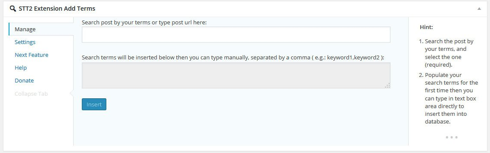
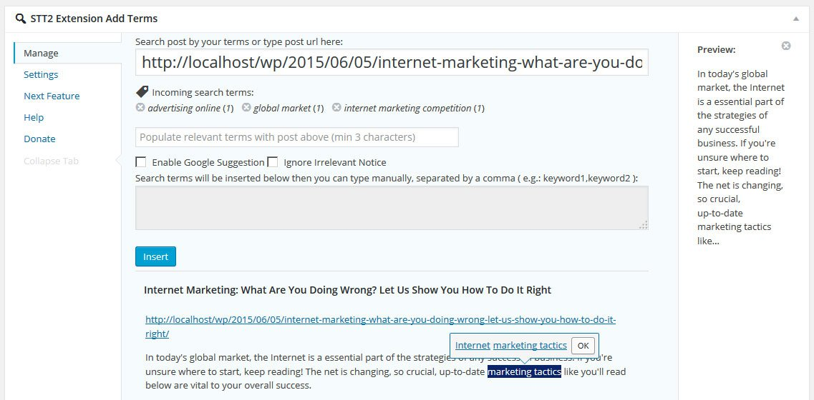
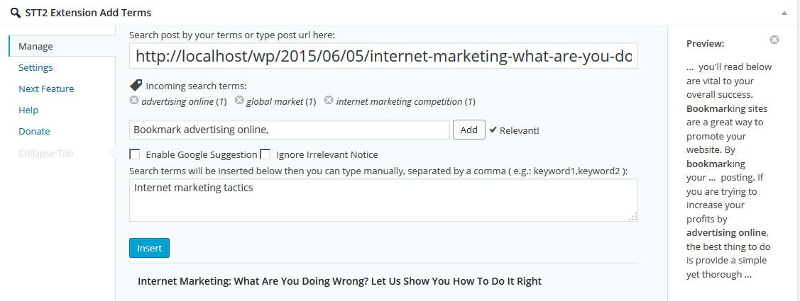

## STT2 Extension Add Terms WordPress Plugin
Manage your search terms better, extended version of SEO SearchTerms Tagging 2 plugin. Add search terms into single post manually. Search the terms that relevant of post content as well as WordPress search default algorithm. JavaScript browser enabled required and the latest modified version of [SEO SearchTerms Tagging 2 plugin](https://github.com/Jevuska/stt2-extension-add-terms/releases/tag/STT2-v1.535) installed.

#### Script Features
* jQuery
* jQuery UI
* Ajax
* Plugin Search Excerpt by Scott Yang
* Google Suggest by haochi

## Frequently Asked Questions

#### Can I add bulk search terms ?
Yes, you can. After you add one or more search terms via input field, just add your search terms list that separated by comma into textarea.

## Installation
1. Upload the entire `STT2 Extension Add Terms` folder to the `/wp-content/plugins/` directory.
2. Activate the plugin through the 'Plugins' menu in WordPress.
3. `STT2 Extension Add Terms` tool inside `SEO SearchTerms Tagging 2` menu in your WordPress admin dashboard.

## Screenshot
1. STT2 Extension Add Terms Feature screenshot-1.jpg.

2. Select keywords screenshot-2.jpg.

3. Insert keywords manually screenshot-3.jpg.

## Changelog
* 1.0.2 = October 16, 2015
 * Fix readability code
 * Fix undefined variable
 * Internationalize plugin
 * minify version jquery-stt2extat.min.js
  
* 1.0.1 = October 13, 2015
 * Remove session PHP
 * Add update plugin check
 * Add Screenshoot

* 1.0.0 = June 28, 2015
 * First official release!

## Upgrade Notice
* v1.0.2
 * This version fixes a security related bug.  Upgrade immediately.