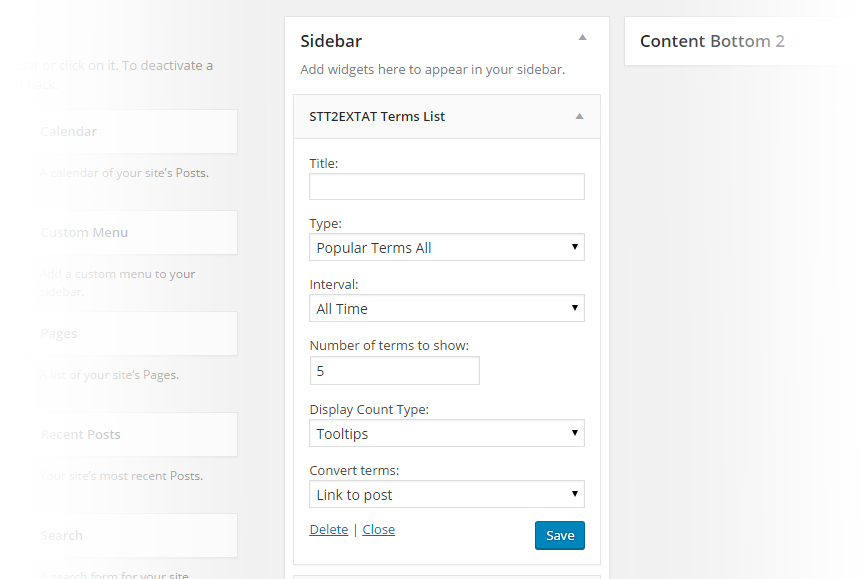

## STT2 Extension Add Terms WordPress Plugin
Manage your terms better, add terms into single post manually, get terms via referrer, and save them as post meta. Search the terms that relevant of post content as well as WordPress search default algorithm.

#### Features
 * Save terms as postmeta ( private meta_key )
 * Manual input terms into postmeta
 * Get terms via referrer ( ajax or PHP )
 * Characters length of terms is min 4 and max 70
 * Show terms list in front end ( ajax or html )
 * General settings, multiple widgets, and shortcode
 * Terms stats
 * Manual or scheduling to delete unused terms
 * Convert text of terms into link ( post or search link )
 * Easy setup search link structure under options permalink page
 * Hook `wp_head` on search page to include canonical rel, and add meta no robots if no posts found
 * Set 404 page with hook pre_get_posts on search page if terms is not allowed or empty ( as note, Headers status code is 200, not 404 )
 * More features and filters available ( see: [ Plugin page ](http://www.jevuska.com/2015/06/28/injeksi-manual-keyword-add-onsextension-plugin-seo-searchterms-tagging-2/ "Plugin page") )
 
#### Requirement
 * jQuery latest version
 * WordPress version 4.4
 * PHP Server version 7.0
 
#### Package
 * The excerpt preview of terms result is supported by Plugin Search Excerpt by Scott Yang
 * Autocomplete terms suggestion is supported by Google Suggest for jQuery plugin by Haochi Chen

#### Next Feature
 * Convert terms into custom taxonomy and feature on terms meta
 
## Frequently Asked Questions

#### Can I add bulk terms ?
Yes, you can. After you add one or more terms via input field, just add your terms list that separated by comma into textarea.

## Installation
1. Upload the entire `STT2 Extension Add Terms` folder to the `/wp-content/plugins/` directory.
2. Activate the plugin through the `Plugins` menu in WordPress.
3. Configure your `STT2EXTAT` settings and you are ready to go.
4. Multiple Widget available under title `STT2EXTAT Terms List`
5. You can use shortcode `[stt2extat]` to show terms list inside post content.

## Screenshot
1. STT2EXTAT General Settings

2. STT2EXTAT Manual Insert Tool and Term Stats

3. STT2EXTAT Multiple Widget

4. STT2EXTAT Permalink for search page

## Changelog
* 1.1.5 = December 17, 2015
 * Fixes parse_request and patch `set_404` as `pre_get_posts` for not allowed terms on search page.
 * Normalize path
 * Fixes list on textarea
 * Add `per_page` number on Screen Options and search box for Term Stats table
 * Fixes ajax tabel pagination
 * Fixes translation bahasa Indonesia
 * Fixes readme files
 * Delete `content-create-tax.php` file, its not ready to setup yet
 
* 1.1.4 = December 16, 2015
 * Fixes wp_get_referer
 
* 1.1.3 = December 16, 2015
 * Fixes bug on search excerpt plugin
 
* 1.1.2 = December 16, 2015
 * Fixes bug empty array when scheduling to delete unused terms
 
* 1.1.2 = December 16, 2015
 * Fixes bug empty array when scheduling to delete unused terms
 
* 1.1.1 = December 16, 2015
 * Patch `wp_list_pluck` when `array_column` function undefined during installation, even this plugin no longer support server with PHP versions lower than 7.
 * Fix `jquery-stt2extat.js` to enable `enter` key when input terms into textarea.
  
* 1.1.0 = December 15, 2015
 * Create admin plugin
 * Available to get terms via referrer
 * Insert terms as post meta
 * Shortcode and widget available
 * Sanitizing input and output of incoming terms
 * Add Search Excerpt plugin for search page snippet
 * Fix hook setup on activation an deactivation
 * Delete files stt2extat-x.x.x.php (x.x.x = version), and create stt2extat-1.1.0.php include in stable minor version 1.1
 * Add comments in each functions
 * Fix translation in Bahasa Indonesia
 * WordPress version 4.4
 * PHP Server version 7.0
 
* 1.0.4 = October 26 2015
 * Change short syntax for arrays at `stt2extat_insert_callback` to work under PHP 5.4
 
* 1.0.3 = October 25, 2015
 * Sanitize, escape, and validate POST, REQUEST calls
 * Remove old jquery UI, use jQuery UI WP Core
 * Update jquery-stt2extat.js
 * Remove unused files and fixes other functions for a security related bug

* 1.0.2 = October 16, 2015
 * Fix readability code
 * Fix undefined variable
 * Internationalize plugin
 * minify version jquery-stt2extat.min.js
  
* 1.0.1 = October 13, 2015
 * Remove session PHP
 * Add update plugin check
 * Add Screenshoot

* 1.0.0 = June 28, 2015
 * First official release!

## Upgrade Notice
###### v1.1.5
Fixes not found search result and bug ajax pagination. Please upgrade yours.

###### v1.1.4
Fixes referrer. Upgrade immediately.

###### v1.1.3
Fixes a security related bug. Upgrade immediately.

###### v1.1.2
Fixes error on scheduling delete unused terms.

###### v1.1.1
Fixes error during installation with PHP versions lower than 7.

###### v1.1.0
This new minor and patch version to fixes a security related bug. Upgrade immediately.

###### v1.0.3
This version fixes a security related bug.  Upgrade immediately.

###### v1.0.2 =
This version fixes a security related bug.  Upgrade immediately.

## Note
Search Excerpt plugin under package of this plugin, a setting is available to enable or disable it.